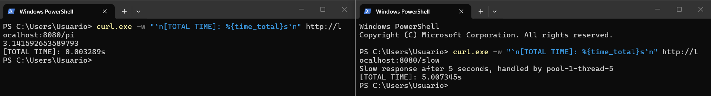
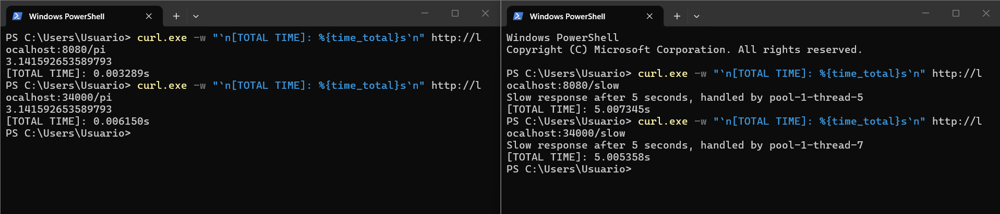
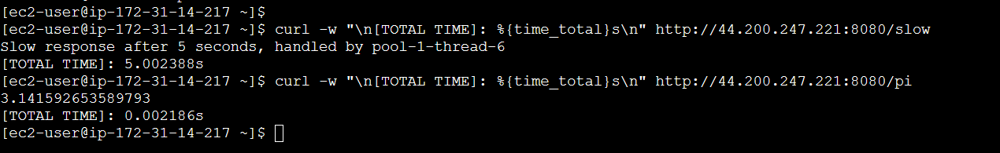
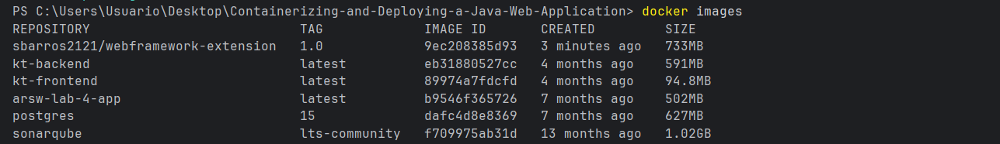
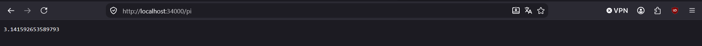
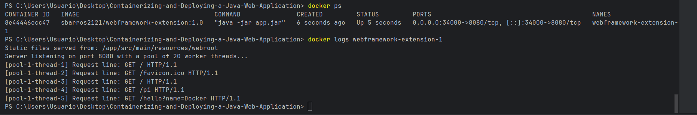
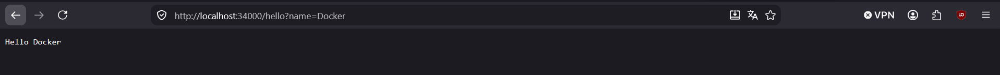
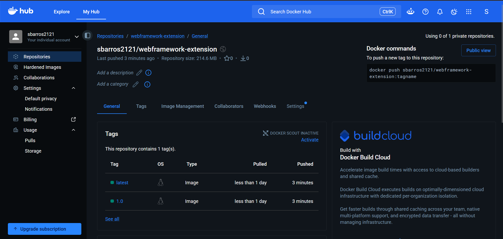
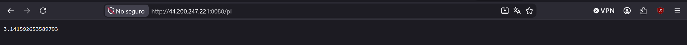
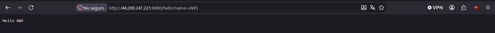

# Web Framework — Concurrency & Cloud-Native Extension

## 1. Current state of the framework

This repository extends the lambda-based, sequential web framework built
in the previous lab (`get()`, `staticfiles()`, `start()`, `stop()`) into a
**concurrent** application server, packaged and deployed as a Docker
container on AWS EC2.

The framework still offers the exact same public API application developers
use — no code in `Application.java`'s route registration changed — but the
underlying `HttpServer` no longer processes one connection at a time.

Framework capabilities to date:

- Static resource serving (HTML, CSS, JS, images), with path-traversal
  protection.
- Lambda-based GET routes with query-string parameter extraction.
- Route resolution with a static-file fallback and `404` for unmatched
  paths.
- Environment-based configuration (`PORT`, `APP_ENV`, `GREETING_PREFIX`,
  `STATIC_FILES_PATH`).
- **Concurrent request handling** (new in this extension).
- **Graceful shutdown**, adapted to work correctly under concurrency
  (new in this extension).
- **Docker containerization** (new in this extension).
- **AWS EC2 deployment via Docker** (new in this extension).

---

## 2. Changes introduced in this extension

### Concurrent request handling

The previous version's `HttpServer` handled each accepted connection
directly on the main thread, inside the accept loop — one client at a
time, strictly sequential.

This extension introduces a **fixed-size thread pool**
(`Executors.newFixedThreadPool(20)`). The main thread's only job now is to
call `accept()` and immediately hand the resulting socket off to the pool
via `workerPool.submit(...)`, then go back to accepting the next
connection. Each worker thread independently parses its request, resolves
a route or a static file, and writes the response — multiple clients are
now served in parallel.

### Graceful shutdown under concurrency

Graceful shutdown had to be adapted, not just carried over:

1. `stop()` still marks the server as not running and closes the listening
   `ServerSocket`, so `accept()` unblocks and no new connections are taken.
2. **New:** after the accept loop exits, the server now calls
   `workerPool.shutdown()` and `awaitTermination(10, TimeUnit.SECONDS)`,
   giving any in-flight requests (already submitted to the pool) time to
   finish sending their response before the process actually exits. If a
   worker doesn't finish within the timeout, `shutdownNow()` forces it, as
   a safety net.

This means a request that is already being served will not be abruptly
cut off just because `/shutdown` was called from a different connection.

### Environment-based port configuration

Unchanged from the previous lab: `PORT` is read from the environment (via
`WebFramework.resolvePort()`), defaulting to `8080` locally. This was
already required infrastructure for the Docker/EC2 deployment in this
extension, since both the container and the EC2 host set `PORT`
externally, with no source code changes needed between environments.

### Docker containerization

A `Dockerfile` based on `amazoncorretto:21` packages the pre-built
`jar-with-dependencies` artifact and runs it as the container's entrypoint,
exposing port `8080` by default (overridable via the `PORT` environment
variable at `docker run` time).

### AWS EC2 deployment

The same Docker image, published to Docker Hub, is pulled and run directly
on an EC2 instance — no Java or Maven installation is required on the host
itself, only the Docker engine.

---

## 3. Evidence of progress

**Relevant commit:** [`Implement concurrent request handling and graceful
shutdown`](https://github.com/sbarros2121/Containerizing-and-Deploying-a-Java-Web-Application/commit/494f4d9)

**Concurrency evidence (local):** two requests fired at nearly the same
time — one to a deliberately slow route (`/slow`, 5-second delay) and one
to a fast route (`/pi`) — show the fast route responding almost instantly
instead of waiting for the slow one to finish, proving requests are now
handled in parallel rather than sequentially.



**Concurrency evidence (EC2 + Docker):** the same test repeated against the
public EC2 address, confirming concurrency holds end-to-end through the
container and the cloud deployment.





---

## 4. How to build and run locally

```bash
git clone https://github.com/sbarros2121/Containerizing-and-Deploying-a-Java-Web-Application.git
cd Containerizing-and-Deploying-a-Java-Web-Application
mvn clean package
```

Run with defaults (port 8080):

```bash
mvn exec:java
```

Or run the packaged JAR directly, with an explicit port:

```bash
PORT=9090 java -jar target/webframework-lab3-jar-with-dependencies.jar
```

Open `http://localhost:8080` (or your configured port) in the browser.

---

## 5. How to run in Docker

### Build the image

```bash
mvn clean package
docker build -t sbarros2121/webframework-extension:1.0 .
```

### Run a container

```bash
docker run -d \
  --name webframework-extension-1 \
  -e PORT=8080 \
  -p 34000:8080 \
  sbarros2121/webframework-extension:1.0
```

Verify:

```bash
docker ps
docker logs webframework-extension-1
```

Test:

http://localhost:34000
http://localhost:34000/pi
http://localhost:34000/hello?name=Docker


### Docker Hub image

The image is published at:

https://hub.docker.com/r/sbarros2121/webframework-extension


Pull it directly with:

```bash
docker pull sbarros2121/webframework-extension:1.0
```

**Evidence — local build and container execution:**






**Evidence — Docker Hub publication:**



---

## 6. Cloud deployment evidence (AWS EC2)

**Platform:** AWS EC2 (Amazon Linux 2023), provisioned through AWS Academy
Learner Lab, region `us-east-1`.

**Public deployment URL:**

http://44.200.247.221:8080


> Note: this is a temporary AWS Academy Learner Lab instance and may be
> terminated after the lab session ends.

### Deployment steps

1. Launched an EC2 instance (Amazon Linux 2023, `t3.micro`, Learner Lab
   default key pair).
2. Configured a Security Group allowing SSH (22, restricted to known IP
   ranges) and a custom TCP rule on port 8080.
3. Connected via EC2 Instance Connect and installed Docker:
```bash
   sudo yum update -y
   sudo yum install -y docker
   sudo service docker start
   sudo usermod -a -G docker ec2-user
```
4. Reconnected (for the group membership to take effect), then pulled and
   ran the published image:
```bash
   docker pull sbarros2121/webframework-extension:1.0

   docker run -d \
     --name webframework-extension \
     --restart unless-stopped \
     -e PORT=8080 \
     -p 8080:8080 \
     sbarros2121/webframework-extension:1.0
```
5. Verified the deployment from inside the instance (`curl`) before testing
   externally from the browser using the public IP address.

### Example URLs

| Resource | URL |
|---|---|
| Home page | `http://44.200.247.221:8080/` |
| Greeting service | `http://44.200.247.221:8080/hello?name=AWS` |
| Pi service | `http://44.200.247.221:8080/pi` |

**Evidence — EC2 deployment:**




---

## 7. Demonstration video

A short video demonstrating the local Docker deployment and the EC2
deployment working is included/linked here:

<!-- Reemplaza con el link real una vez grabado y subido -->
`<LINK_AL_VIDEO>`

The video shows:
- The container running locally (`docker ps`, the app responding in the
  browser).
- The same image pulled and running on the EC2 instance.
- The application responding correctly from the public EC2 address.

---

## 8. Known limitations

- Only the **GET** HTTP method is supported.
- No middleware, path parameters, or POST/PUT/DELETE support.
- No authentication or HTTPS.
- Thread pool size is fixed (20) rather than dynamically tuned based on
  load.
- The EC2 deployment uses a single instance with no load balancing or
  redundancy.

---

## 9. Author

**Sebastián Barros**